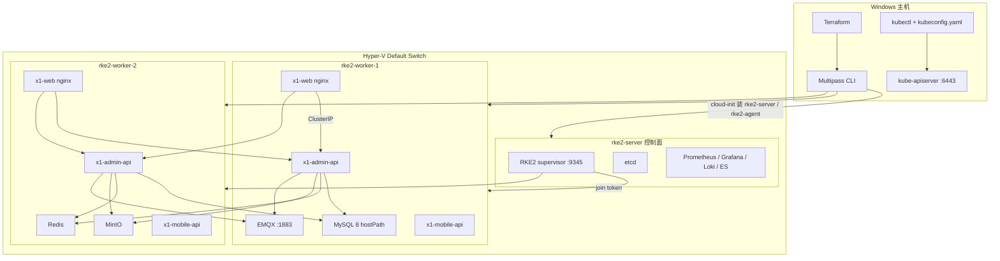
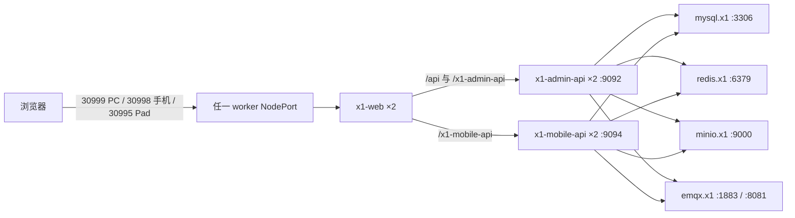

# 为什么这样设计，以及高可用架构

这份文档回答三件事：实验室为什么做成「一主两从 + 控制面隔离」；X1 的高可用做到哪一层、做不到哪一层；请求从浏览器走到 MySQL / MQTT 时故障域怎么切。

## 1. 设计目标

这是一台 Windows 工作站上的 **可重复实验集群**，不是生产多活机房。目标按优先级是：

1. **能在国内网络下稳定装起来**：RKE2 安装包走 `rancher-mirror.rancher.cn`，运行时镜像走 DaoCloud / 南大 Docker Hub 代理。
2. **控制面和业务面分开**：1 个 RKE2 server 专跑 API / etcd / scheduler；2 个 agent 专跑 X1。
3. **X1 应用层可丢一台 worker**：管理端、移动端、静态站各 2 副本，反亲和打散，PDB 保证滚动时至少活 1 个。
4. **有完整观测闭环**：指标（Prometheus）、日志检索（Loki + Elasticsearch）、统一看板（Grafana）。
5. **仓库只留 X1**：mall、示例 Nginx、JAR 解包中间文件全部清掉，避免和 X1 抢内存、抢注意力。

刻意没做的：3 控 etcd、外部负载均衡、CSI 动态卷、证书自动轮转、生产级密钥管理。这些在 2C4G × 3 的 Hyper-V 虚拟机上会先把 Java 和 MySQL 挤死。

## 2. 为什么是 Terraform + Multipass + RKE2

| 选择 | 原因 | 放弃的替代 |
| --- | --- | --- |
| **Hyper-V + Multipass** | Windows 上最省事的 Ubuntu 云镜像启动方式，和本机已开的 Hyper-V 一致 | WSL2 单节点、Vagrant、手搓 Hyper-V |
| **Terraform 调 Multipass CLI** | 集群 token、cloud-init、server IP、kubeconfig 有依赖顺序，IaC 能表达；本机应用控制会拦截未签名的第三方 Multipass Provider | 社区 `larstobi/multipass` Provider |
| **RKE2 而不是 kubeadm / k3s** | 发行版自带 containerd、Canal、CoreDNS、Traefik；server/agent 模型适合「一主两从」；和 Rancher 生态同一套安装脚本 | kubeadm 组件太多；k3s 更轻但默认 SQLite、和本仓库后续 Rancher 习惯不一致 |
| **Canal（Flannel VXLAN + Calico policy）** | RKE2 默认，实验室不需要拆 CNI | Cilium / Calico 纯种（多镜像、多 CRD） |
| **控制面 NoSchedule** | 业务只上 worker，server 留给 etcd 和观测栈 | 三台都跑业务（更挤、更难解释故障） |

Terraform 在这里的职责不是「管理 Kubernetes 对象」，而是 **把三台虚拟机和 RKE2 引导变成可销毁、可复现的状态**。X1 和观测清单用 `kubectl apply`，不进 Terraform，避免改一行 YAML 就触发虚拟机重建。

更细的安装链路、镜像、端口见 [02-Terraform与RKE2技术栈.md](02-Terraform与RKE2技术栈.md)。

## 3. 高可用做到哪一层

```text
                    生产级 HA          本实验室
 控制面 / etcd        3 或 5 节点         1 个 server（单点）
 Worker               N，可扩容           2 台，固定
 应用副本             HPA + PDB           固定 2 副本 + PDB
 中间件               主从 / 集群         单副本 + hostPath 钉节点
 存储                 CSI / 外部盘        hostPath（跟虚拟机绑定）
 入口                 VIP / LB            NodePort（两台 worker 都通）
 观测                 独立集群            挤在控制面，单副本
```

结论：**worker 挂一台，X1 的 Web / Admin API / Mobile API 仍应可访问**；**server 挂了，kubectl 和观测不可用，已经跑着的业务 Pod 会继续，但无法调度新的**；**钉在某台 worker 上的 MySQL / Redis / MinIO / EMQX 挂了，对应能力就断**。

这是在 12GB 虚拟机配额下能说清楚、也能演示的最大 HA 边界。

## 4. 集群与 X1 架构图



控制面带污点 `node-role.kubernetes.io/control-plane=true:NoSchedule`。X1 全部 Deployment / StatefulSet **没有** 这个容忍，因此 Java、Nginx、中间件只会落到 worker。观测栈显式写了容忍 + `nodeSelector`，只跑在 `rke2-server`。

## 5. X1 应用层如何高可用

| 工作负载 | 副本 | 调度 | 为什么 |
| --- | --- | --- | --- |
| `x1-admin-api` | 2 | 首选反亲和，打散到两台 worker | 同一 Deployment 的两个 Pod，不是两套应用。JAR、端口、探针相同，Service 按 label 负载 |
| `x1-mobile-api` | 2 | 同上 | 独立 JAR、端口 9094，和 admin 不是一个进程 |
| `x1-web` | 2 | 同上 | Nginx 托管三套静态资源，并反代两个 API |
| PDB | minAvailable=1 | 三个 Deployment 各一份 | 滚动更新 `maxUnavailable: 1`，保证始终有一副本接流量 |
| MySQL | 1 | 钉 `rke2-worker-1` | 322 张表、hostPath `/data/x1/mysql`，实验室没有可靠的 MySQL Operator |
| Redis / MinIO | 1 | 钉 `rke2-worker-2` | 和 MySQL 错开，避免一台 worker 同时扛库和对象存储 |
| EMQX | 1 | 钉 `rke2-worker-1` | MQTT 与 MySQL 同节点，IoT 上报链路短 |

反亲和用的是 **preferred** 不是 required：两台 worker 都能调度时一定拆开；若一台 NotReady，另一台仍能各跑 2 个 Java（内存会很紧，但服务不因硬性反亲和而 Pending）。

滚动策略 `maxSurge: 0`：升级时先杀一个再起一个，避免 3 个 768Mi 的 Java 同时出现在 4G 节点上。

## 6. 请求路径

浏览器只认 **任意 worker 的 NodePort**。kube-proxy 把 30999 / 30998 / 30995 / 30092 / 30094 转到对应 Service，再按 Endpoints 分到两个 Pod。



Nginx 配置在 `k8s/x1/30-nginx.yaml` 的 ConfigMap 里：

- PC `9999`：静态 `x1pc/dist`，`/api/` 与 WebSocket 转到 admin-api。
- 移动 `9998`：静态 `x1mobile/dist`，`/x1-mobile-api` 转到 mobile-api。
- Pad `9995`：静态 `x1pad/dist`，API 仍走 admin-api。

Java 使用 `SPRING_PROFILES_ACTIVE=docker`，把 compose 里的主机名换成集群 DNS：`MYSQL_DS1_IP=mysql`、`--jack.mqtt.host=tcp://emqx:1883`、`--minio.endpoint=http://minio:9000`。`HOST_IP` / `HOST_AI_IP` 仍写当前 worker 地址，给少数需要「对外回调 IP」的模块用。

## 7. 故障怎么表现

| 故障 | 期望 | 不期望 |
| --- | --- | --- |
| 杀掉一个 `x1-admin-api` Pod | Service 仍指向另一个副本；PDB 保证滚动时至少 1 个 | 短暂 TCP 失败，客户端应重试 |
| `rke2-worker-2` 关机 | admin / mobile / web 仍在 worker-1；MySQL、EMQX 仍在 | Redis、MinIO 不可用，依赖缓存或对象存储的接口失败 |
| `rke2-worker-1` 关机 | 应用副本仍在 worker-2 | MySQL、EMQX 不可用，几乎所有写接口失败 |
| `rke2-server` 关机 | 已运行的 X1 Pod 继续；NodePort 仍通 | 无法 kubectl、无法调度、观测全挂 |
| 单个 Java OOM | kubelet 重启该 Pod；另一副本继续 | 768Mi limit + `-Xmx384m` 是在 UReport / 栈溢出之后折中的，突发报表仍可能重启 |

## 8. 为什么中间件不做成集群

- **内存**：worker 实测已用约 76–78%（约 3.0Gi / 3.9Gi）。MySQL 主从、EMQX 集群、MinIO distributed 再加一套，Java 双副本会立刻 OOM。
- **存储**：没有 CSI。hostPath 绑死主机名，副本数 > 1 不会共享数据，只会脑裂。
- **演示价值**：中间件钉节点反而能把「应用 HA ≠ 数据 HA」讲清楚。需要数据 HA 时，应先加磁盘和独立中间件节点，而不是在现有 4G worker 上堆副本。

## 9. 制品怎么进集群

`scripts/deploy-x1-ha.ps1` 把 `deploy/deploy_local/deploy_local` 里的 JAR、字体、前端 dist 同步到两台 worker 的 `/data/x1/...`，然后 `kubectl apply` 三份清单。Java 镜像是 `eclipse-temurin:8-jre`，用 hostPath 挂 JAR，避免每次改业务都重新打镜像。

MySQL 首次从 `x1.sql` 导入（约 322 张表）。脚本用临时目录做 `kubectl cp`，不再把 SQL 拷进 `k8s/x1/`。

## 10. 和监测的关系

观测栈不能再和 Java 抢 worker。Prometheus、Grafana、Loki、Elasticsearch 全部容忍控制面污点，钉在 `rke2-server`。Promtail（写 Loki）和 Filebeat（写 ES）是 DaemonSet，每台机器采一份容器日志，这样 **Loki 和 ES 都会真正用上**，而不是只起空服务。

细节见 [03-运维监测.md](03-运维监测.md)。
