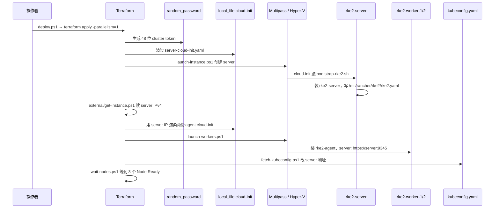

# Terraform、Multipass 与 RKE2 技术栈

集群从「零」到「三节点 Ready」只走 `.\deploy.ps1`。这条链路里 Terraform 负责状态和顺序，Multipass 负责虚拟机，cloud-init 负责把 Ubuntu 变成 RKE2 节点。

## 1. 总览



`-parallelism=1` 是必须的：Multipass 并发 `launch` 会抢同一份 Ubuntu 云镜像锁，Windows 上经常直接失败。

## 2. 为什么 Terraform 长这样

本机应用控制策略会拦截 **未签名的第三方 Terraform Provider**。社区 Multipass Provider 因此不能用。仓库只用 HashiCorp 官方插件：

| Provider | 用途 |
| --- | --- |
| `hashicorp/random` | `random_password.cluster_token`，server / agent 共享的 join token |
| `hashicorp/local` | 把 tftpl 渲染成 `terraform/generated/*-cloud-init.yaml` |
| `hashicorp/external` | 调 `scripts/get-instance.ps1`，把 `multipass list` 的 IP 收成 JSON |

真正创建 / 销毁虚拟机的是 `terraform_data` + `local-exec`，解释器固定为 PowerShell：

- 创建：`scripts/launch-instance.ps1`、`scripts/launch-workers.ps1`
- 销毁：`scripts/delete-instance.ps1`、`scripts/delete-instances.ps1`
- kubeconfig：`scripts/fetch-kubeconfig.ps1`
- 等待 Ready：`scripts/wait-nodes.ps1`

`terraform_data.server` 的 `input` 含 `cloud_sha = content_md5(server cloud-init)`。`terraform_data.workers` 含全部 worker cloud-init 的 sha256。**改模板 = 改哈希 = 下次 apply 按「先 destroy provisioner 再 create」重建虚拟机。** 集群已经跑 X1 之后，不要为了「顺手改一行」去 apply。

## 3. Multipass 在做什么

| 项 | 值 |
| --- | --- |
| 驱动 | `hyperv`（`multipass get local.driver`） |
| 镜像 | Ubuntu `22.04` 云镜像 |
| 网络 | Hyper-V Default Switch，DHCP |
| server | 2 vCPU / 4G / 40G，名字 `${cluster_name}-server` |
| worker | 2 vCPU / 4G / 30G × `worker_count`（默认 2） |

`launch-instance.ps1` 的关键行为：

1. 若实例状态是 Deleted，先 `delete --purge`。
2. 若实例已在但没有 `/var/log/rke2-bootstrap.done`，视为引导失败，删掉重建。
3. 若已完成引导，直接复用，避免 Terraform 刷新时误杀集群。
4. `multipass launch ... --cloud-init ... --timeout` 后执行 `cloud-init status --wait`，再轮询 bootstrap 标记。

这是「可中断再跑」的前提：第一次镜像没下完、第二次 apply 不应无脑再开一台同名机。

## 4. RKE2 是什么、本实验室怎么用

[RKE2](https://docs.rke2.io/)（Rancher Kubernetes Engine 2）是 Rancher 的生产向 Kubernetes 发行版。和 kubeadm 比，它把 containerd、CNI、Ingress、CoreDNS 打成一套 systemd 服务。

本仓库角色模型：

| systemd 单元 | 节点 | 进程职责 |
| --- | --- | --- |
| `rke2-server` | `rke2-server` | kube-apiserver、scheduler、controller-manager、etcd、以及本机 kubelet / 代理 |
| `rke2-agent` | 两台 worker | kubelet + kube-proxy/agent，向 server `:9345` 注册 |

安装脚本来源由 `use_china_mirror` 决定（`terraform/terraform.tfvars` 默认 `true`）：

```text
INSTALL_RKE2_TYPE=server|agent
INSTALL_RKE2_MIRROR=cn
INSTALL_URL=https://rancher-mirror.rancher.cn/rke2/install.sh
```

`rke2_version` 留空则跟 stable 通道。本次落地版本是 **`v1.36.4+rke2r1`**，containerd 为 `containerd://2.3.4-k3s1.36`。

### 4.1 配置文件

server `/etc/rancher/rke2/config.yaml` 由 cloud-init 写出：

```yaml
token: <terraform 生成>
write-kubeconfig-mode: "0644"
tls-san:
  - rke2-server
  - <检测到的 IPv4>
node-name: rke2-server
node-label:
  - "role=control-plane"
node-taint:
  - "node-role.kubernetes.io/control-plane=true:NoSchedule"
```

`tls-san` 必须包含 Windows 主机将来要写进 kubeconfig 的 IP，否则 kubectl 证书校验失败。

agent：

```yaml
server: https://<server-ip>:9345
token: <同一 token>
node-name: rke2-worker-N
node-label:
  - "role=worker"
  - "node-role.kubernetes.io/worker=true"
```

`:9345` 是 RKE2 **supervisor**，不是 Kubernetes API。worker 先连 9345 拉证书和集群信息，再连 `:6443`。只开 6443 不够。

### 4.2 国内镜像：为什么不用阿里云 system-default-registry

早期试过 `system-default-registry: registry.cn-hangzhou.aliyuncs.com`。对 **v1.36.4-rke2r1** 的 `rancher/rke2-runtime` 等标签，阿里云返回 `MANIFEST_UNKNOWN`，`rke2-server` 会进入重启循环。

当前做法是 **不改默认 registry**，只写 `/etc/rancher/rke2/registries.yaml`，让 containerd 拉 `docker.io` 时走代理：

```yaml
mirrors:
  docker.io:
    endpoint:
      - "https://docker.m.daocloud.io"
      - "https://docker.nju.edu.cn"
      - "https://registry-1.docker.io"
```

RKE2 自己的镜像仍按官方名字拉（`docker.io/rancher/...`），只是下载走国内端点。`registry.k8s.io` 不在这份 mirrors 里；观测栈里需要 k8s 仓库的镜像（例如 kube-state-metrics）必须在清单里写成 DaoCloud 的 `k8s.m.daocloud.io/...`。

### 4.3 默认可视组件

| 组件 | 命名空间 | 作用 |
| --- | --- | --- |
| Canal | `kube-system` | Flannel VXLAN（UDP 8472）+ Calico 网络策略 |
| CoreDNS | `kube-system` | 集群 DNS，X1 用 `mysql` / `redis` / `emqx` 短名 |
| Traefik | `kube-system` | RKE2 自带 Ingress；X1 当前走 NodePort，未用 Ingress |
| etcd | 仅 server | 单节点，控制面单点 |

## 5. kubeconfig 怎么回到 Windows

RKE2 在 server 上写出 `/etc/rancher/rke2/rke2.yaml`，里面的 server 默认是 `https://127.0.0.1:6443`。`fetch-kubeconfig.ps1` 把它拉下来，改成 `https://<server-ip>:6443`，写到仓库根目录 `kubeconfig.yaml`。

虚拟机重启后 Default Switch DHCP 换 IP 时：

```powershell
multipass list
.\scripts\fetch-kubeconfig.ps1 -ServerName rke2-server -ServerIP <新IP> -OutFile D:\K8S-LAB\kubeconfig.yaml
$env:KUBECONFIG = "D:\K8S-LAB\kubeconfig.yaml"
```

同时要改 `k8s/x1/20-apps.yaml` 里 `HOST_IP` / `HOST_AI_IP`（少数模块把这个地址当对外回调），然后 `kubectl apply`，**不要 terraform apply**。

## 6. 变量与命令

编辑 `terraform/terraform.tfvars`：

| 变量 | 默认 | 含义 |
| --- | --- | --- |
| `cluster_name` | `rke2` | 实例名前缀 |
| `worker_count` | `2` | agent 数量，1–5 |
| `image` | `22.04` | Multipass Ubuntu 别名 |
| `server_memory` / `worker_memory` | `4G` | 改内存会重建对应虚拟机 |
| `use_china_mirror` | `true` | 国内安装源 + Docker Hub 代理 |
| `control_plane_taint` | `true` | 控制面不可调度普通业务 |
| `rke2_version` | 空 | 空=stable；可钉死 `v1.36.4+rke2r1` |

```powershell
# 创建
.\deploy.ps1

# 等价
cd D:\K8S-LAB\terraform
terraform init
terraform apply -auto-approve -parallelism=1

# 进入节点
multipass shell rke2-server
multipass exec rke2-server -- sudo journalctl -u rke2-server -f
multipass exec rke2-worker-1 -- sudo journalctl -u rke2-agent -f
multipass exec rke2-server -- sudo tail -n 200 /var/log/rke2-bootstrap.log

# 销毁（会 purge 三台虚拟机，hostPath 数据一起没）
.\destroy.ps1
```

## 7. 端口

| 端口 | 谁监听 | 用途 |
| --- | --- | --- |
| TCP 6443 | server | Kubernetes API |
| TCP 9345 | server | RKE2 supervisor，worker 加入 |
| TCP 10250 | 所有节点 | kubelet |
| UDP 8472 | 所有节点 | Canal / Flannel VXLAN |
| TCP 30092–32200 | NodePort | X1 与观测入口，见 README |

节点之间必须互通。Windows 主机只要能 ping 到 Default Switch 上的三台 IPv4，就可以 kubectl 和浏览器访问 NodePort。

## 8. 故障排查（基础设施）

**`rke2-server` 起不来，日志 `MANIFEST_UNKNOWN`**

镜像仓库没有对应 runtime 标签。检查 `/etc/rancher/rke2/registries.yaml`，不要把 `system-default-registry` 指到过期的阿里云 Rancher 仓库。

**cloud-init / Terraform 卡在 bootstrap**

```powershell
multipass exec rke2-server -- sudo cat /var/log/rke2-bootstrap.log
multipass exec rke2-server -- sudo journalctl -u rke2-server -n 100 --no-pager
```

**kubectl 证书错误或连不上 6443**

IP 变了。`multipass list` 后重跑 `fetch-kubeconfig.ps1`。

**业务 Pod Pending**

不要调度到 `rke2-server`（除非是观测栈那种写了容忍的）。`kubectl describe pod` 看污点和资源。

**误 apply 重建了 worker**

hostPath 在虚拟机磁盘上，实例被 purge 后 MySQL / Redis / MinIO / 前端 dist 都没了，只能再跑 `deploy-x1-ha.ps1` 从 `deploy/` 同步并重新导入 SQL。
