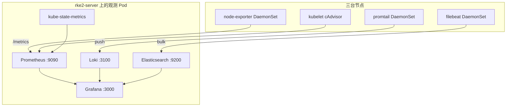

# 运维监测：Prometheus、Grafana、Loki、Elasticsearch

X1 的 Java 双副本已经把两台 worker 的内存用到约 76%。监测组件因此 **全部钉在控制面**（`rke2-server` 约 59% / 2.3Gi），采集器用 DaemonSet 覆盖三台节点。Prometheus、Grafana、Loki、Elasticsearch 四个都启用，不是只装一个再写进文档。

## 1. 四个组件各自干什么



| 组件 | 角色 | 本实验室怎么用 |
| --- | --- | --- |
| **Prometheus** | 拉取型指标库 | 刮 node-exporter、kube-state-metrics、kubelet/cAdvisor、自身 |
| **Grafana** | 统一可视化 | 三个数据源：Prometheus / Loki / Elasticsearch；预置集群与 X1 看板 |
| **Loki** | 日志标签索引 | Promtail 采 `/var/log/pods`（CRI），按 namespace / pod 查，适合 `kubectl logs` 的替代 |
| **Elasticsearch** | 全文检索 | Filebeat 同一批容器日志再写一份，适合关键字、JSON 字段搜索 |

Loki 和 ES **不是重复摆设**：Loki 轻、和 Grafana Explore 的 LogQL 一体；ES 擅长倒排和过滤。采集端各写各的，互不影响。

没有单独上 Tempo / Jaeger：X1 JAR 未接 tracing SDK，加了也没有 span。

## 2. 为什么观测在控制面

| 节点 | 实测内存 | 再堆观测的结果 |
| --- | --- | --- |
| worker-1 / worker-2 | 约 3.0Gi / 3.9Gi，Java limit 已 768Mi × 2 | ES + Prometheus 会和 X1 抢 RSS，OOM 先杀业务 |
| server | 约 2.3Gi / 3.9Gi，污点挡住了普通业务 | 只多跑单副本观测，堆调到实验室最小值 |

调度约定：

```yaml
nodeSelector:
  kubernetes.io/hostname: rke2-server
tolerations:
  - key: node-role.kubernetes.io/control-plane
    operator: Exists
    effect: NoSchedule
```

DaemonSet（node-exporter / promtail / filebeat）带同样容忍，才能在 server 上也采到 kube-system 和观测自身的日志。

单控制面意味着 **观测本身不是 HA**：server 宕机后 Grafana 一起没。这和 etcd 单点是同一边界，文档里不假装多活。

## 3. 资源与镜像

堆内存按「能起来、不把 server 打满」压过：

| 工作负载 | 副本 | 请求 / 限制 | 备注 |
| --- | --- | --- | --- |
| elasticsearch | 1 | 256Mi / 640Mi | `ES_JAVA_OPTS=-Xms256m -Xmx256m`，单节点，关闭 xpack |
| prometheus | 1 | 128Mi / 384Mi | 本地盘 7 天，2Gi 上限 |
| loki | 1 | 128Mi / 256Mi | filesystem + tsdb v13 |
| grafana | 1 | 64Mi / 192Mi | 预置数据源和看板 |
| kube-state-metrics | 1 | 16Mi / 64Mi | 对象状态（副本、Pending、重启） |
| node-exporter | 3 | 16Mi / 48Mi | 机器 CPU / 内存 / 磁盘 |
| promtail | 3 | 32Mi / 80Mi | 推 Loki |
| filebeat | 3 | 48Mi / 128Mi | 推 ES |

镜像一律走国内可拉的地址（`docker.io` 由 RKE2 `registries.yaml` 代理；`registry.k8s.io` 写成 `k8s.m.daocloud.io`）：

- `docker.m.daocloud.io/prom/prometheus:v2.53.1`
- `docker.m.daocloud.io/prom/node-exporter:v1.8.2`
- `docker.m.daocloud.io/grafana/grafana:11.2.2`
- `docker.m.daocloud.io/grafana/loki:3.1.1`
- `docker.m.daocloud.io/grafana/promtail:3.1.1`
- `docker.m.daocloud.io/library/elasticsearch:7.17.21`
- `docker.m.daocloud.io/elastic/filebeat:7.17.21`
- `k8s.m.daocloud.io/kube-state-metrics/kube-state-metrics:v2.13.0`

数据落在 server 的 hostPath：`/data/obs/{prometheus,loki,elasticsearch}`。`deploy-observability.ps1` 会先 `mkdir`。

## 4. 部署与入口

```powershell
$env:KUBECONFIG = "D:\K8S-LAB\kubeconfig.yaml"
powershell -File D:\K8S-LAB\scripts\deploy-observability.ps1
```

脚本会：在 `rke2-server` 建目录 → `kubectl apply -f k8s/observability` → 等核心 Deployment Ready。

| 服务 | NodePort | 本机 URL（IP 以 `multipass list` 为准） |
| --- | --- | --- |
| Grafana | 32000 | http://172.26.220.97:32000 |
| Prometheus | 32090 | http://172.26.220.97:32090 |
| Elasticsearch | 32200 | http://172.26.220.97:32200 |

Grafana 实验室账号：`admin` / `admin`。登录后数据源已预置，不必手配。

```powershell
# ES 是否接住 Filebeat
curl.exe http://172.26.220.97:32200/_cat/indices?v

# Prometheus 目标是否 UP
# 浏览器打开 http://172.26.220.97:32090/targets
```

## 5. 在 Grafana 里怎么查

**指标（Prometheus）**

- 看板 **K8S-LAB / Cluster & X1**：节点 CPU/内存、kube-system 与 `x1` 的 Pod 重启、X1 Deployment 可用副本。
- Explore 示例：

```promql
sum by (instance) (node_memory_MemTotal_bytes - node_memory_MemAvailable_bytes)
sum by (pod) (kube_pod_container_status_restarts_total{namespace="x1"})
kube_deployment_status_replicas_available{namespace="x1"}
```

**日志（Loki / LogQL）**

```logql
{namespace="x1"} |= "ERROR"
{namespace="x1", pod=~"x1-admin-api.*"}
{namespace="observability"}
```

**日志（Elasticsearch）**

数据源名 `Elasticsearch`，索引 `filebeat-*`，时间字段 `@timestamp`。在 Explore 里按 `kubernetes.pod.name`、`message` 过滤。适合「某个业务异常码全库搜」。

## 6. 采集权限

`observability` ServiceAccount 绑了一份 ClusterRole，覆盖：

- `nodes` / `nodes/metrics` / `nodes/proxy`（Prometheus 经 API 反代 kubelet）
- `pods` / `services` / `endpoints` / `namespaces`
- `/metrics` 非资源 URL
- Promtail / Filebeat 读集群元数据做标签

这是只读刮取，没有对业务对象的写权限。

## 7. 已知边界

- 单副本、单磁盘、无告警管理器。要钉钉/邮件告警需要再加 Alertmanager，本仓库先把「能看见」做完。
- ES 7.17 堆只有 256m，索引保留靠磁盘，实验室不要灌无限制日志。Filebeat 只采容器标准输出。
- Loki 3.x 用 filesystem + 单 ring，不能扩成微服拆分。
- 控制面内存再涨（例如再加一套 Java）时，应先把观测迁走或给 server 加内存，而不是再 `terraform apply` 改 worker。
- 卸载：`kubectl delete ns observability`，然后 `multipass exec rke2-server -- sudo rm -rf /data/obs`。
